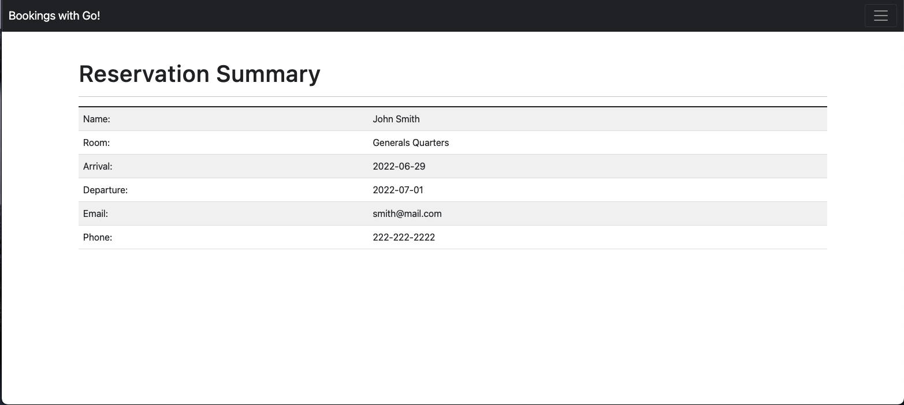
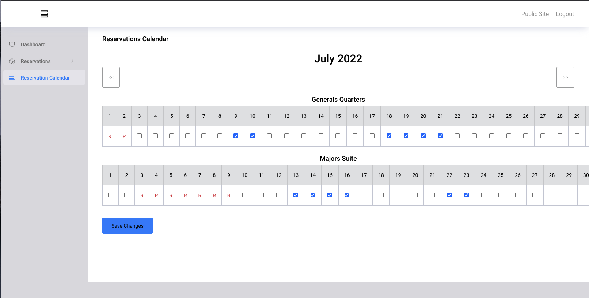
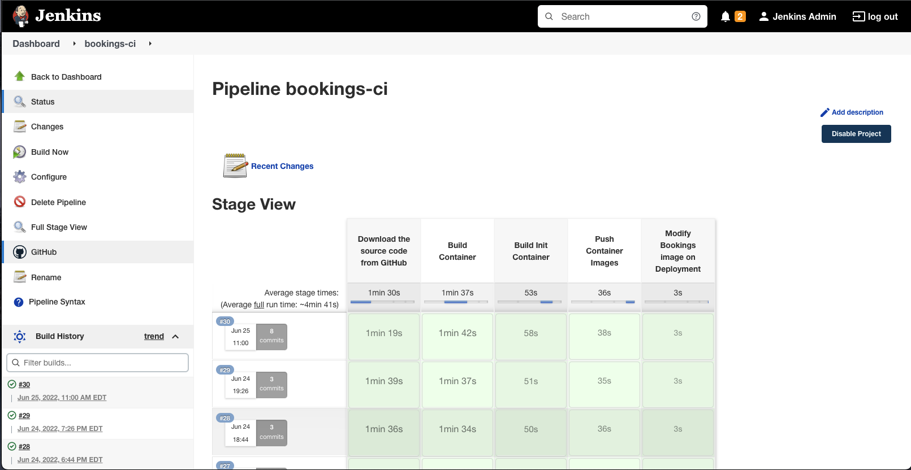
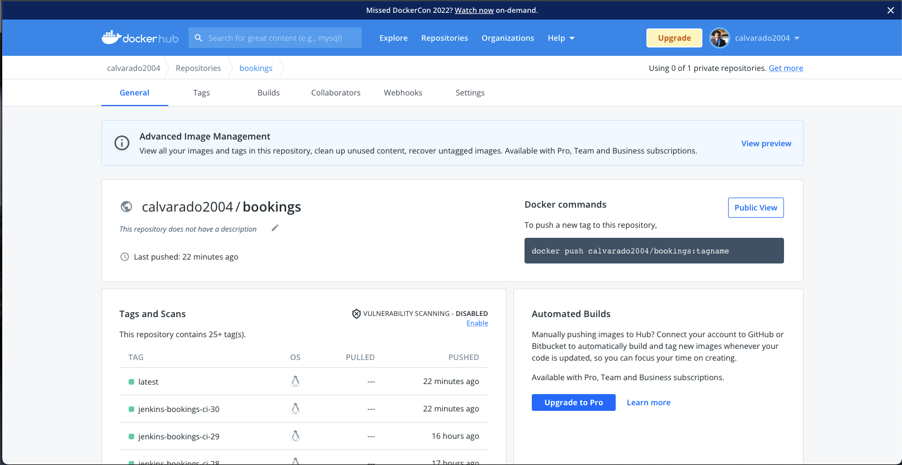
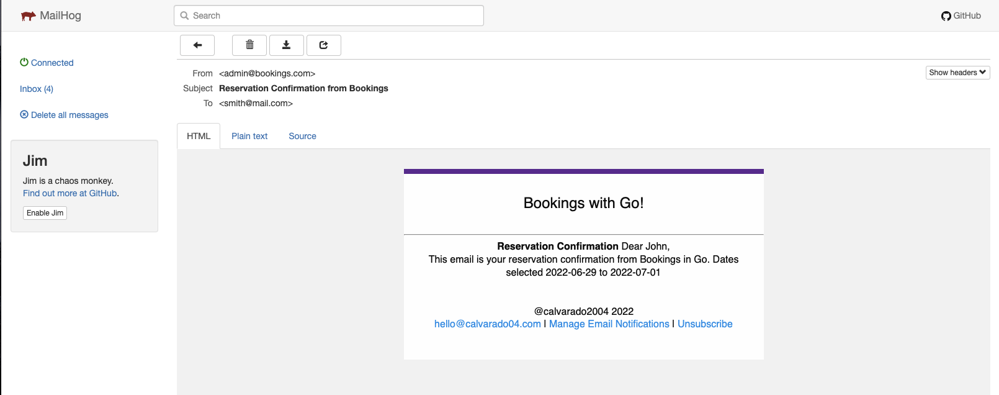
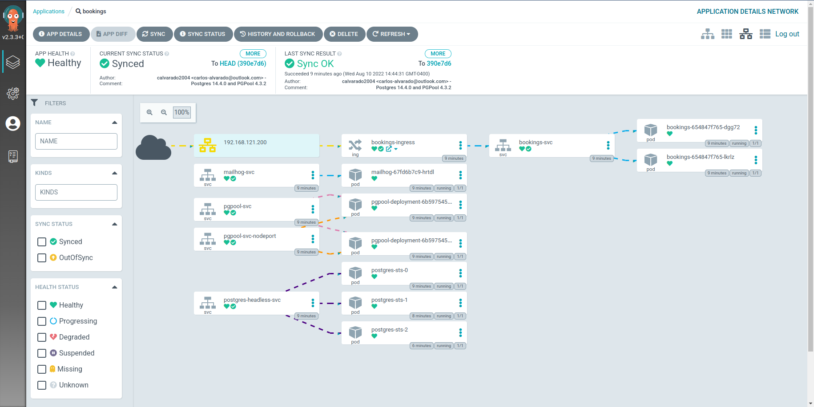

# Booking and reservations program in Go

This is the repository for the Bookings and reservations in Go

- Built in Go version 1.18.1
- Uses the [chi browser](github.com/go-chi/chi/v5)
- Uses [alex edwards](github.com/alexedwards/scs/v2) SCS session manager 
- Uses [nosurf](github.com/justinas/nosurf) 

# Admin site

Use the following credentials to check the admin site:

`user: admin@mail.com`

`pass: admin`





# Test this application locally

Install and start a local PostgreSQL instance and set the `postgres` user password to `postgres`:

[Download PostgreSQL](https://www.postgresql.org/download/)

Install Go 1.18.1 or newer:

[Download Go](https://go.dev/dl/)

Download this project:

```
git clone https://github.com/calvarado2004/bookings
```

Init the Go modules:

```
go mod init github.com/calvarado2004/bookings
go mod tidy
go get github.com/alexedwards/scs/v2
go get github.com/go-chi/chi/v5
go get github.com/justinas/nosurf
go get github.com/asaskevich/govalidator 
go get github.com/xhit/go-simple-mail/v2
```

Compile and start the application:

```
./run.sh
```

The application will be available here: 

[localhost:8080/bookings](http://localhost:8080/bookings)


# Jenkins pipeline for Continuous Integration

This project generates two containers, the init container to make the DB migrations with [Soda](https://gobuffalo.io/documentation/database/migrations/) and the main application container.
\
The Groovy pipeline used to make these containers is available, it uses [Buildah](https://buildah.io/) instead of the whole Docker application



# Docker images generated

The container images are being uploaded to the Docker Hub Public registry

- [init container](https://hub.docker.com/repository/docker/calvarado2004/bookings-init)
- [bookings application](https://hub.docker.com/repository/docker/calvarado2004/bookings)



# Integration with MailHog

This application includes [MailHog](https://github.com/mailhog/MailHog) integration, however, is not configured with any email server. You would have to configure that if you really want to test this feature.

MailHog by default can be accessed through the port 8025:

[localhost:8025](http://localhost:8025)



# Continuous Deployment with ArgoCD

ArgoCD can control its automatic deployment from the cd repository [bookings-cd](https://github.com/calvarado2004/bookings-cd)


